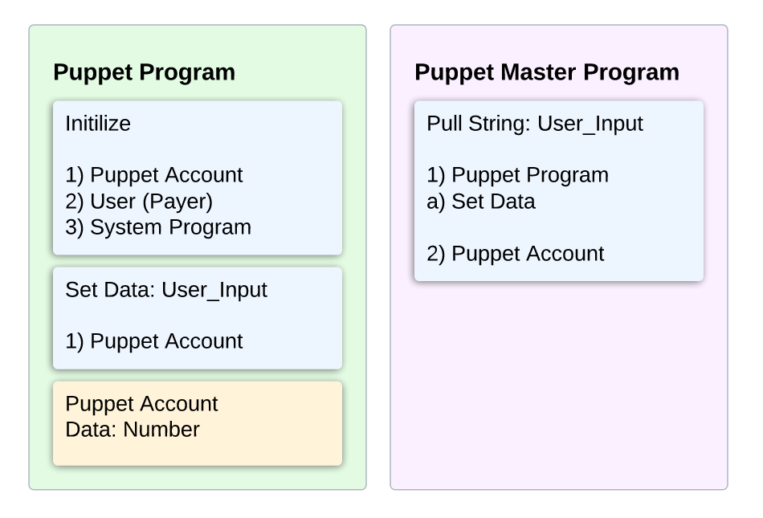
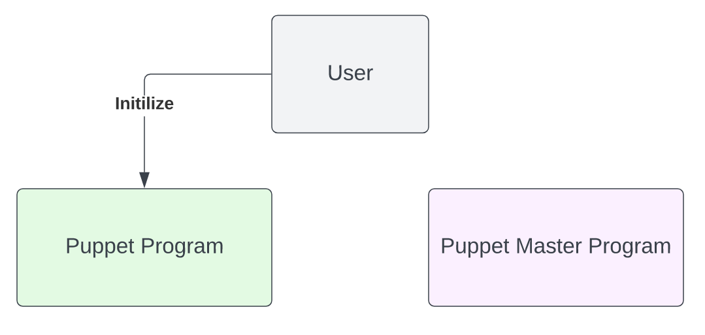
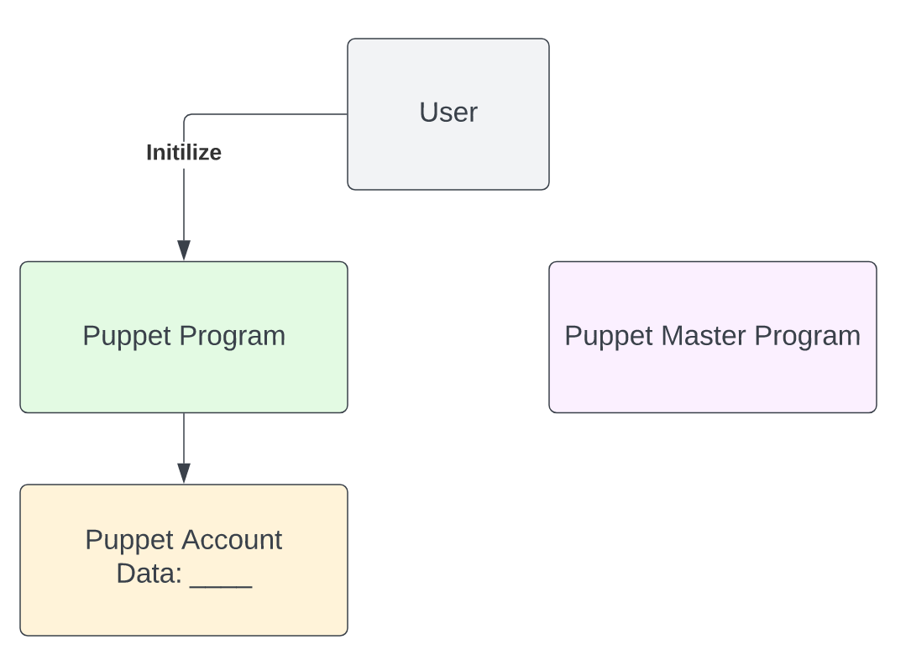
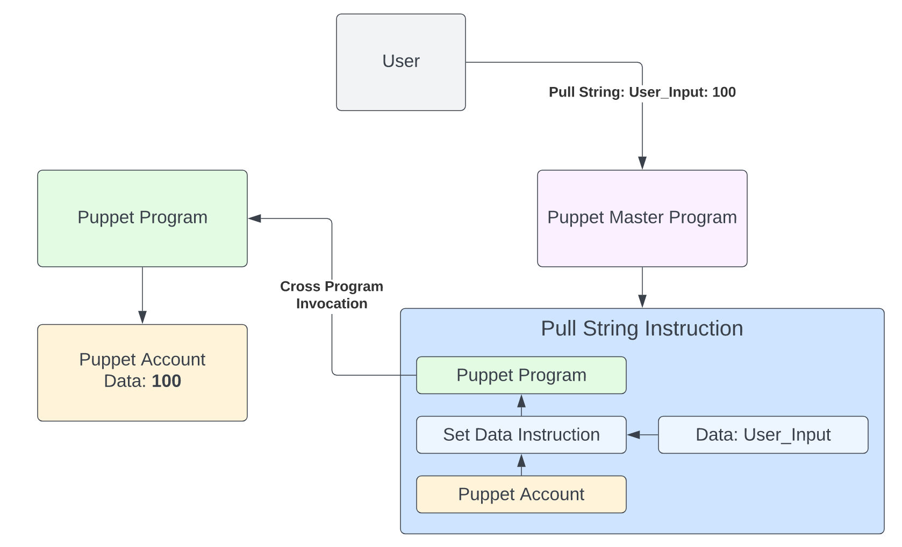

# Cross Program Invocation (CPI)

Cross Program Invocation allow Solana programs to call instructions from other programs, enabling composability between Solana programs.

## Facts

::: tip Fact Sheet

- Cross Program Invocations enable for programs to call instructions on other programs, allowing for the composibility of Solana programs.
- Program Derived Addresses (PDAs) can be used to invoke signatures across programs.
- CPI calls are currently limited to a depth of 4

  :::

## Deep Dive

### Basic CPI functionality

Consider the example of a Puppet Program and a Puppet Master Program. The Puppet Master Program will be used to invoke an instruction on the Puppet Program.

The Puppet Program has two instructions.

1. Initialize
2. Set Data

Initialize creates a Puppet Account which holds Data, in this example a number. Set Data then sets the Data field in the Puppet Account with a User_Input.

The Puppet Master Program has one instruction.

1. Pull String

Pull String is a CPI of the Set Data instruction on the Puppet Program to update the Data field of the Puppet Account created by the Puppet Program.

A user calls the Initialize instruction on the Puppet Program.

The Puppet Program then creates a Puppet Account with an empty Data field.

The user calls the Pull String instruction on the Puppet Master Program and provides a User_Input of 100. The Pull String instruction then calls the Set Data instruction on the Puppet Program and sets the empty Data field on the Puppet Account to the User_Input of 100.

## Other Resources

- [Official Documentation](https://docs.solana.com/developing/programming-model/calling-between-programs)
- [Anchor Cross-Program Invocations](https://book.anchor-lang.com/chapter_3/CPIs.html)
