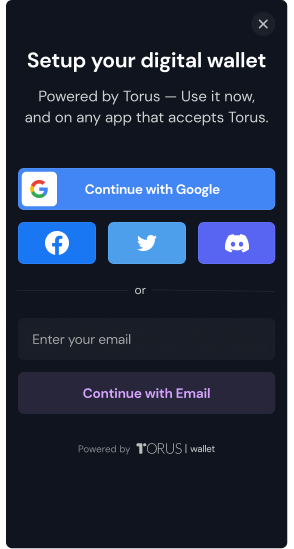

# Wallet

## Was ist eine Brieftasche?

Eine Krypto-Wallet ist eine digitale Geldbörse, die zur Interaktion mit der Blockchain verwendet wird. Es ermöglicht Ihnen, Transaktionen zu signieren, zu verifizieren und zu senden. Es gibt viele Krypto-Wallet-Lösungen auf dem Markt, die von einfach zu bedienenden Web-Apps bis hin zu komplexeren Hardware-Sicherheitslösungen reichen.

## Soziale Logins auf Solana

[**Web3Auth**](https://docs.web3auth.io/) ermöglicht es Benutzern, sich mit ihren bestehenden Web2-OAuth-Anbietern (Facebook, Google, Twitter usw.) bei Web3-Dapps anzumelden. Es bietet einen benutzerfreundlichen und [nicht verwahrungsfreien](https://docs.web3auth.io/key-infrastructure/overview) Ansatz zur Verwaltung von Vermögenswerten und Identität. Es beseitigt technische Barrieren und reduziert die Lernkurve für den digitalen Besitz für alle Benutzer, indem es einen Wrapper für die Verwaltung privater Schlüssel bereitstellt.

## Integrationsleitfaden

Dieses Tutorial führt Sie durch ein einfaches Beispiel zur Integration von Social Logins in Ihre DApp.

### Abhängigkeiten installieren

Um die Brieftasche mit einer DApp zu verwenden, können Sie `@toruslabs/solana-embed` installieren. Sie können gängige Paketmanager wie Garn und npm verwenden, um sie herunterzuladen.

<CodeGroup>
  <CodeGroupItem title="YARN" active>

```bash
yarn add @toruslabs/solana-embed
```

  </CodeGroupItem>

  <CodeGroupItem title="NPM">

```bash
npm install --save @toruslabs/solana-embed
```

  </CodeGroupItem>
</CodeGroup>

### Importieren Sie das SDK und initialisieren Sie es

Im folgenden Codeausschnitt erstellen wir eine Instanz von solana-embed und initialisieren sie dann mit einer Testumgebung, die solana testnet verwendet. Sie können andere Konfigurationsoptionen übergeben, während Sie die Wallet-Schnittstelle initialisieren. Weitere Informationen dazu finden Sie unter solana-embed [api-reference](https://docs.tor.us/solana-wallet/api-reference/class).

<SolanaCodeGroup>
  <SolanaCodeGroupItem title="TS" active>

  <template v-slot:default>

@[code](@/code/wallet/Web3Auth/initialize-instance.en.ts)

  </template>

  <template v-slot:preview>

@[code](@/code/wallet/Web3Auth/initialize-instance.preview.en.ts)

  </template>

  </SolanaCodeGroupItem>
</SolanaCodeGroup>

### Benutzeranmeldung auslösen

Rufen Sie einfach `torus.login()` auf, um eine Anmeldung auszulösen, wo immer es in Ihrem Anwendungslebenszyklus sinnvoll ist. Beim Aufrufen der Anmeldemethode ohne Parameter wird ein Modal geöffnet, in dem der Benutzer alle unterstützten Anmeldungen auswählen kann.



Nach erfolgreicher Anmeldung gibt die Methode ein Array öffentlicher Schlüssel zurück. Das erste Element des Arrays ist der aktuelle öffentliche Schlüssel der Brieftasche

<SolanaCodeGroup>
  <SolanaCodeGroupItem title="TS" active>

  <template v-slot:default>

@[code](@/code/wallet/Web3Auth/login.en.ts)

  </template>

  <template v-slot:preview>

@[code](@/code/wallet/Web3Auth/login.preview.en.ts)

  </template>

  </SolanaCodeGroupItem>
</SolanaCodeGroup>

### Verwenden der Torus-Instanz zum Abrufen von Benutzerkontodetails

Die Torus-Instanz bietet eine Schnittstelle für Interaktionen wie das Signieren von Transaktionen und Nachrichten im eingeloggten Zustand. Es kann uns auch eine Schnittstelle für den Zugriff auf Benutzeranmeldeinformationen wie die E-Mail-Adresse, das Profilbild usw. des Benutzers bereitstellen (abhängig von der Anmeldemethode).

<SolanaCodeGroup>
  <SolanaCodeGroupItem title="TS" active>

  <template v-slot:default>

@[code](@/code/wallet/Web3Auth/user-info.en.ts)

  </template>

  <template v-slot:preview>

@[code](@/code/wallet/Web3Auth/user-info.preview.en.ts)

  </template>

  </SolanaCodeGroupItem>
</SolanaCodeGroup>

### Verwenden der Torus Solana-API zum Signieren einer Nachricht.

Um eine Nachricht zum Signieren durch den Benutzer zu senden, muss die Webanwendung eine UTF-8-codierte Zeichenfolge als Uint8Array bereitstellen.

Jedes Mal, wenn ein Benutzer eine Nachricht signieren möchte, öffnet das Wallet ein Bestätigungsfenster.

<SolanaCodeGroup>
  <SolanaCodeGroupItem title="TS" active>

  <template v-slot:default>

@[code](@/code/wallet/Web3Auth/sign-message.en.ts)

  </template>

  <template v-slot:preview>

@[code](@/code/wallet/Web3Auth/sign-message.preview.en.ts)

  </template>

  </SolanaCodeGroupItem>
</SolanaCodeGroup>

In ähnlicher Weise können Sie auch die Methoden [signTransaction](https://docs.tor.us/solana-wallet/api-reference/solana/sign-transaction) und „signAllTransactions“ auf der Torus-Instanz zum Signieren einzelner bzw. mehrerer Transaktionen verwenden.

### Verwenden der Torus Solana-API zum Senden einer Transaktion

Um eine Transaktion zu senden, muss man einfach die Methode „sendTransaction“ auf der Torus-Instanz aufrufen und die „Transaktion“ übergeben.

Das Wallet öffnet ein Bestätigungsfenster. Nach der Genehmigung signiert das SDK und sendet die Transaktion an die Kette.

<SolanaCodeGroup>
  <SolanaCodeGroupItem title="TS" active>

  <template v-slot:default>

@[code](@/code/wallet/Web3Auth/send-transaction.en.ts)

  </template>

  <template v-slot:preview>

@[code](@/code/wallet/Web3Auth/send-transaction.preview.en.ts)

  </template>

  </SolanaCodeGroupItem>
</SolanaCodeGroup>

### Aufladungen

Derzeit unterstützt die API Aufladungen von Moonpay.

<SolanaCodeGroup>
  <SolanaCodeGroupItem title="TS" active>

  <template v-slot:default>

@[code](@/code/wallet/Web3Auth/topup.en.ts)

  </template>

  <template v-slot:preview>

@[code](@/code/wallet/Web3Auth/topup.preview.en.ts)

  </template>

  </SolanaCodeGroupItem>
</SolanaCodeGroup>

### Ausloggen

Um den Benutzer abzumelden, müssen Sie lediglich die „Logout“-Funktion in der Torus-Wallet-Instanz aufrufen.

<SolanaCodeGroup>
  <SolanaCodeGroupItem title="TS" active>

  <template v-slot:default>

@[code](@/code/wallet/Web3Auth/logout.en.ts)

  </template>
    
  <template v-slot:preview>
    
@[code](@/code/wallet/Web3Auth/logout.preview.en.ts)
    
  </template>

  </SolanaCodeGroupItem>
</SolanaCodeGroup>

## Ressourcen

* [solana-embed](https://github.com/torusresearch/solana-embed)
* [Api Reference](https://docs.web3auth.io/solana-wallet/api-reference/class)
* [Hosted Demo](https://demo-solana.tor.us/)
* [Sample React Integration](https://github.com/torusresearch/solana-embed-react-demo)
* [Solana Wallet](https://solana.tor.us/)