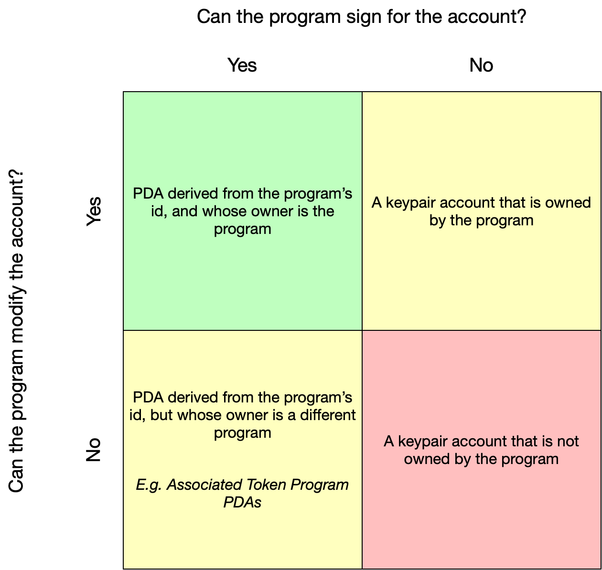

# Program Derived Addresses (PDAs)

Ang Program Derived Addresses (Mga PDA) ay tahanan ng mga account na idinisenyo upang kontrolin ng isang partikular na programa. Sa mga PDA, ang mga programa ay maaaring mag-sign program para sa ilang partikular na address nang hindi nangangailangan ng pribadong key. Ang mga PDA ay nagsisilbing pundasyon para sa [Cross-Program Invocation](https://docs.solana.com/developing/programming-model/calling-between-programs#cross-program-invocations), na nagbibigay-daan sa mga Solana app na maging composable sa isa't isa.

## Facts

::: tip Fact Sheet
- Ang mga PDA ay 32 byte string na mukhang mga pampublikong key, ngunit walang kaukulang pribadong key
- Ang `findProgramAddress` ay tiyak na kukuha ng PDA mula sa isang programId at mga buto (koleksyon ng mga byte)
- Isang bump (isang byte) ang ginagamit upang itulak ang isang potensyal na PDA mula sa ed25519 elliptic curve
- Maaaring mag-sign ang mga program para sa kanilang mga PDA sa pamamagitan ng pagbibigay ng mga buto at bump sa [invoke_signed](https://docs.solana.com/developing/programming-model/calling-between-programs#program-signed-accounts)
- Ang isang PDA ay maaari lamang pirmahan ng programa kung saan ito hinango
- Bilang karagdagan sa pagpapahintulot sa mga programa na mag-sign para sa iba't ibang mga instruction, ang mga PDA ay nagbibigay din ng isang interface na parang hashmap para sa [mga indexing account](../guides/account-maps.md)
:::

## Deep Dive

Ang mga PDA ay isang mahalagang building block para sa pagbuo ng mga programa sa Solana. Sa mga PDA, maaaring mag-sign ang mga program para sa mga account habang ginagarantiyahan na walang external na user ang makakabuo din ng wastong lagda para sa parehong account. Bilang karagdagan sa pag-sign para sa mga account, maaari ding baguhin ng ilang programa ang mga account na hawak sa kanilang mga PDA.

<small style="text-align:center;display:block;">Larawan ng kagandahang-loob ni <a href="https://twitter.com/pencilflip">Pencilflip</a></small>

### Generating PDAs

Upang maunawaan ang konsepto sa likod ng mga PDA, maaaring makatulong na isaalang-alang na ang mga PDA ay hindi teknikal na nilikha, ngunit sa halip ay natagpuan. Ang mga PDA ay nabuo mula sa kumbinasyon ng mga buto (gaya ng string `“vote_account”`) at isang program id. Ang kumbinasyong ito ng mga buto at program id ay pinapatakbo sa pamamagitan ng sha256 hash function upang makita kung bumubuo sila ng pampublikong key na nasa ed25519 elliptic curve o hindi.

Sa pagpapatakbo ng aming program id at seeds sa pamamagitan ng hash function, mayroong ~50% na pagkakataon na talagang magkakaroon kami ng wastong pampublikong key na nasa elliptic curve. Sa kasong ito, nagdaragdag lang kami ng isang bagay upang i-fudge ang aming input nang kaunti at subukang muli. Ang teknikal na termino para sa fudge factor na ito ay isang bump. Sa Solana, magsisimula tayo sa bump = 255 at umulit lang pababa sa bump = 254, bump = 253, atbp. hanggang sa makakuha tayo ng address na wala sa elliptic curve. Ito ay maaaring mukhang pasimula, ngunit kapag nahanap na ito ay nagbibigay sa amin ng isang tiyak na paraan ng pagkuha ng parehong PDA nang paulit-ulit.

### Interacting with PDAs

When a PDA is generated, `findProgramAddress` will return both the address and Kapag nabuo ang isang PDA, ibabalik ng `findProgramAddress` ang address at ang bump na ginamit upang maalis ang address sa elliptic curve. Gamit ang bump na ito, ang isang program ay maaaring [mag-sign](../references/accounts.md#sign-with-a-pda) para sa anumang pagtuturo na nangangailangan ng PDA nito. Upang makapirma, dapat na ipasa ng mga programa ang pagtuturo, ang listahan ng mga account, at ang mga buto at bump na ginamit upang gawing `invoke_signed` ang PDA. Bilang karagdagan sa pag-sign para sa mga instruction, dapat ding pumirma ang mga PDA para sa sarili nilang paggawa sa pamamagitan ng `invoke_signed`.

Kapag nagtatayo gamit ang mga PDA, karaniwan nang [imbakin ang bump seed](https://github.com/solana-labs/solana-program-library/blob/78e29e9238e555967b9125799d7d420d7d12b959/token-swap/program/src/state.rs#L100) sa mismong data ng account. Nagbibigay-daan ito sa mga developer na madaling ma-validate ang isang PDA nang hindi kinakailangang pumasa sa bump bilang argumento ng pagtuturo.

## Other Resources
- [Official Documentation](https://docs.solana.com/developing/programming-model/calling-between-programs#program-derived-addresses)
- [Understanding Program Derived Addresses](https://www.brianfriel.xyz/understanding-program-derived-addresses/)
