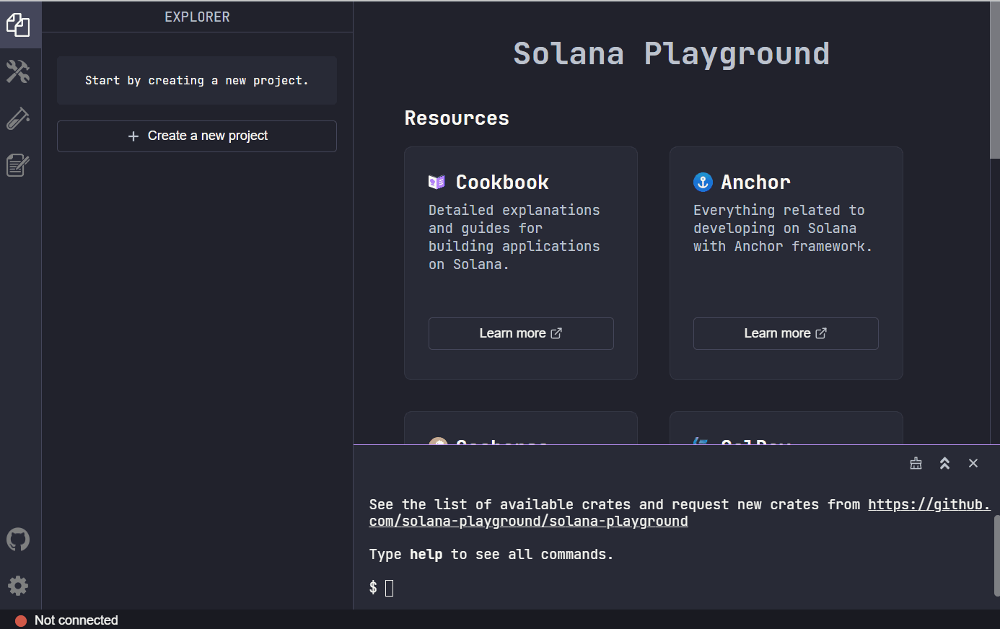

# Pagbuo ng on-chain na laro sa Solana

## Pagsisimula sa iyong unang laro ng Solana

Walkthrough ng Video:
<div class="video-block">
<iframe width="320" height="200" src="https://www.youtube.com/embed/_vQ3bSs3svs" title="YouTube video player" frameborder="0" allow="accelerometer; autoplay; clipboard-write; encrypted-media; gyroscope; picture-in-picture; web-share" allowfullscreen></iframe>
</div>

Live na Bersyon. (gamitin ang devnet sa naka-embed na bersyon)
<iframe height='400' scrolling='no' title='OZXQWp' src='https://solplay.de/TinyAdventure/index.html' frameborder='no' allowtransparency='true' allowfullscreen='true' style='width: 80%;'>
</iframe>

## Tiny Adventure

Ang Tiny Adventure ay isang beginner-friendly na programang Solana na nilikha gamit ang Anchor framework. Ang layunin ng program na ito ay ipakita sa iyo kung paano lumikha ng isang simpleng laro na nagbibigay-daan sa mga manlalaro na subaybayan ang kanilang posisyon at lumipat pakaliwa o kanan.

Ang Tiny Adventure Program ay binubuo lamang ng 3 mga instruction:

- `initialize` - Ang instruction na ito ay nagse-set up ng on-chain na account upang iimbak ang posisyon ng manlalaro
- `move_left` - Hinahayaan ng pagtuturo na ito ang player na ilipat ang kanilang posisyon sa kaliwa
- `move_right` - Hinahayaan ng pagtuturo na ito ang player na ilipat ang kanilang posisyon sa kanan

Sa mga paparating na seksyon, tatalakayin natin ang proseso ng pagbuo ng larong ito nang sunud-sunod.
Mahahanap mo ang kumpletong source code, na magagamit upang i-deploy mula sa iyong browser, sa [halimbawa ng Solana Playground](https://beta.solpg.io/tutorials/tiny-adventure).

Kung kailangan mong maging pamilyar sa Anchor framework, huwag mag-atubiling tingnan ang Anchor module ng [Solana Course](https://www.soldev.app/course) para makapagsimula.

### Pagsisimula

Upang simulan ang pagbuo ng larong Tiny Adventure, sundin ang mga hakbang na ito:

Bisitahin ang [Solana Playground](https://beta.solpg.io/) at gumawa ng bagong Anchor project. Kung bago ka sa Solana Playground, kakailanganin mo ring gumawa ng Playground Wallet. Narito ang isang halimbawa kung paano gamitin ang Solana Playground:



Pagkatapos gumawa ng bagong proyekto, palitan ang default na starter code ng code sa ibaba:

```rust
use anchor_lang::prelude::*;

declare_id!("11111111111111111111111111111111");

#[program]
mod tiny_adventure {
    use super::*;
}

fn print_player(player_position: u8) {
    if player_position == 0 {
        msg!("A Journey Begins!");
        msg!("o.......");
    } else if player_position == 1 {
        msg!("..o.....");
    } else if player_position == 2 {
        msg!("....o...");
    } else if player_position == 3 {
        msg!("........\\o/");
        msg!("You have reached the end! Super!");
    }
}
```

Sa larong ito, magsisimula ang manlalaro sa posisyon 0 at maaaring lumipat pakaliwa o pakanan. Upang ipakita ang pag-unlad ng manlalaro sa buong laro, gagamitin namin ang mga log ng mensahe upang ipakita ang kanilang paglalakbay.

### Pagtukoy sa Game Data Account

Ang unang hakbang sa pagbuo ng laro ay upang tukuyin ang isang istraktura para sa on-chain na account na mag-iimbak ng posisyon ng manlalaro.

Ang `GameDataAccount` struct ay naglalaman ng isang field, `player_position`, na nag-iimbak ng kasalukuyang posisyon ng player bilang isang unsigned 8-bit integer.

```rust
use anchor_lang::prelude::*;

declare_id!("11111111111111111111111111111111");

#[program]
mod tiny_adventure {
    use super::*;

}

...

// Define the Game Data Account structure
#[account]
pub struct GameDataAccount {
    player_position: u8,
}
```

### Magsimula ng Instruksyon

Pagkatapos tukuyin ang account ng programa, ipatupad natin ang instruction na `initialize`. Sinisimulan ng instruction na ito ang `GameDataAccount` kung wala pa ito, itinatakda ang `player_position` sa 0, at mag-print ng ilang log ng mensahe.

Ang instruction na `initialize` ay nangangailangan ng 3 account:

- `new_game_data_account` - ang `GameDataAccount` na sinisimulan namin
- `signer` - ang player na nagbabayad para sa initialization ng `GameDataAccount`
- `system_program` - isang kinakailangang account kapag gumagawa ng bagong account

```rust
#[program]
pub mod tiny_adventure {
    use super::*;

    // Instruction to initialize GameDataAccount and set position to 0
    pub fn initialize(ctx: Context<Initialize>) -> Result<()> {
        ctx.accounts.new_game_data_account.player_position = 0;
        msg!("A Journey Begins!");
        msg!("o.......");
        Ok(())
    }
}

// Specify the accounts required by the initialize instruction
#[derive(Accounts)]
pub struct Initialize<'info> {
    #[account(
        init_if_needed,
        seeds = [b"level1"],
        bump,
        payer = signer,
        space = 8 + 1
    )]
    pub new_game_data_account: Account<'info, GameDataAccount>,
    #[account(mut)]
    pub signer: Signer<'info>,
    pub system_program: Program<'info, System>,
}

...
```

Sa halimbawang ito, ginagamit ang Program Derived Address (PDA) para sa `GameDataAccount` na address. Ito ay nagbibigay-daan sa amin na tiyak na mahanap ang address sa ibang pagkakataon. Mahalagang tandaan na ang PDA sa halimbawang ito ay nabuo na may iisang nakapirming halaga bilang seed (`level1`), na naglilimita sa aming programa sa paglikha lamang ng isang `GameDataAccount`. Ang `init_if_needed` constraint pagkatapos ay tinitiyak na ang `GameDataAccount` ay sinisimulan lamang kung hindi pa ito umiiral.

Ito ay nagkakahalaga na tandaan na ang kasalukuyang pagpapatupad ay walang anumang mga paghihigpit sa kung sino ang maaaring baguhin ang `GameDataAccount`. Epektibo nitong ginagawang isang multiplayer na karanasan ang laro kung saan makokontrol ng lahat ang paggalaw ng manlalaro.

Bilang kahalili, maaari mong gamitin ang address ng lumagda bilang isang karagdagang binhi sa pagtuturo na `initialize`, na magbibigay-daan sa bawat manlalaro na lumikha ng kanilang sariling `GameDataAccount`.

### Ilipat ang Instruksyon sa Kaliwa

Ngayon na maaari na nating simulan ang isang `GameDataAccount` account, ipatupad natin ang instruction na `move_left`. Nagbibigay-daan ito sa isang player na i-update ang kanilang `player_position`. Sa halimbawang ito, ang paglipat sa kaliwa ay nangangahulugan lamang ng pagbabawas ng `player_position` ng 1. Itatakda din namin ang minimum na posisyon sa 0.

Ang tanging account na kailangan para sa pagtuturo na ito ay ang `GameDataAccount`.

```rust
#[program]
pub mod tiny_adventure {
    use super::*;
    ...

    // Instruction to move left
    pub fn move_left(ctx: Context<MoveLeft>) -> Result<()> {
        let game_data_account = &mut ctx.accounts.game_data_account;
        if game_data_account.player_position == 0 {
            msg!("You are back at the start.");
        } else {
            game_data_account.player_position -= 1;
            print_player(game_data_account.player_position);
        }
        Ok(())
    }
}

// Specify the account required by the move_left instruction
#[derive(Accounts)]
pub struct MoveLeft<'info> {
    #[account(mut)]
    pub game_data_account: Account<'info, GameDataAccount>,
}

...
```

### Pagtuturo sa Pakanan

Panghuli, ipatupad natin ang instruction na `move_right`. Sa katulad na paraan, ang paglipat sa kanan ay nangangahulugan lamang ng pagtaas ng `player_position` ng 1. Nililimitahan din namin ang maximum na posisyon sa 3.

Katulad ng dati, ang tanging account na kailangan para sa pagtuturo na ito ay ang `GameDataAccount`.

```rust
#[program]
pub mod tiny_adventure {
    use super::*;
		...

		// Instruction to move right
		pub fn move_right(ctx: Context<MoveRight>) -> Result<()> {
		    let game_data_account = &mut ctx.accounts.game_data_account;
		    if game_data_account.player_position == 3 {
		        msg!("You have reached the end! Super!");
		    } else {
		        game_data_account.player_position = game_data_account.player_position + 1;
		        print_player(game_data_account.player_position);
		    }
		    Ok(())
		}
}

// Specify the account required by the move_right instruction
#[derive(Accounts)]
pub struct MoveRight<'info> {
    #[account(mut)]
    pub game_data_account: Account<'info, GameDataAccount>,
}

...
```

### I-build at I-deploy

Nakumpleto na namin ngayon ang programang Tiny Adventure! Ang iyong panghuling programa ay dapat na katulad ng sumusunod:

```rust
use anchor_lang::prelude::*;

// This is your program's public key and it will update
// automatically when you build the project.
declare_id!("BouPBVWkdVHbxsdzqeMwkjqd5X67RX5nwMEwxn8MDpor");

#[program]
mod tiny_adventure {
    use super::*;

    pub fn initialize(ctx: Context<Initialize>) -> Result<()> {
        ctx.accounts.new_game_data_account.player_position = 0;
        msg!("A Journey Begins!");
        msg!("o.......");
        Ok(())
    }

    pub fn move_left(ctx: Context<MoveLeft>) -> Result<()> {
        let game_data_account = &mut ctx.accounts.game_data_account;
        if game_data_account.player_position == 0 {
            msg!("You are back at the start.");
        } else {
            game_data_account.player_position -= 1;
            print_player(game_data_account.player_position);
        }
        Ok(())
    }

    pub fn move_right(ctx: Context<MoveRight>) -> Result<()> {
        let game_data_account = &mut ctx.accounts.game_data_account;
        if game_data_account.player_position == 3 {
            msg!("You have reached the end! Super!");
        } else {
            game_data_account.player_position = game_data_account.player_position + 1;
            print_player(game_data_account.player_position);
        }
        Ok(())
    }
}

fn print_player(player_position: u8) {
    if player_position == 0 {
        msg!("A Journey Begins!");
        msg!("o.......");
    } else if player_position == 1 {
        msg!("..o.....");
    } else if player_position == 2 {
        msg!("....o...");
    } else if player_position == 3 {
        msg!("........\\o/");
        msg!("You have reached the end! Super!");
    }
}

#[derive(Accounts)]
pub struct Initialize<'info> {
    #[account(
        init_if_needed,
        seeds = [b"level1"],
        bump,
        payer = signer,
        space = 8 + 1
    )]
    pub new_game_data_account: Account<'info, GameDataAccount>,
    #[account(mut)]
    pub signer: Signer<'info>,
    pub system_program: Program<'info, System>,
}

#[derive(Accounts)]
pub struct MoveLeft<'info> {
    #[account(mut)]
    pub game_data_account: Account<'info, GameDataAccount>,
}

#[derive(Accounts)]
pub struct MoveRight<'info> {
    #[account(mut)]
    pub game_data_account: Account<'info, GameDataAccount>,
}

#[account]
pub struct GameDataAccount {
    player_position: u8,
}
```

Sa pagtatapos ng programa, oras na para buuin at i-deploy ito sa Solana Playground!

Kung ito ang unang pagkakataon mong gumamit ng Solana Playground, gumawa muna ng Playground Wallet at tiyaking nakakonekta ka sa isang Devnet endpoint. Pagkatapos, patakbuhin ang `solana airdrop 2` hanggang sa magkaroon ka ng 6 na SOL. Kapag mayroon kang sapat na SOL, buuin at i-deploy ang programa.


### Magsimula sa Kliyente

Gagabayan ka ng susunod na seksyong ito sa isang simpleng pagpapatupad sa panig ng kliyente para sa pakikipag-ugnayan sa laro. Susuriin namin ang code at magbibigay ng mga detalyadong paliwanag para sa bawat hakbang. Sa Solana Playground, mag-navigate sa `client.ts` file at idagdag ang mga snippet ng code mula sa mga sumusunod na seksyon.

Una, kunin natin ang PDA para sa `GameDataAccount`. Ang PDA ay isang natatanging address sa format ng isang pampublikong susi, na hinango gamit ang ID ng programa at mga karagdagang binhi. Huwag mag-atubiling tingnan ang mga PDA lesson ng [Solana Course](https://www.soldev.app/course) para sa higit pang mga detalye.

```js
// The PDA adress everyone will be able to control the character if the interact with your program
const [globalLevel1GameDataAccount, bump] =
  await anchor.web3.PublicKey.findProgramAddress(
    [Buffer.from("level1", "utf8")],
    pg.program.programId
  );
```

Susunod, subukan nating kunin ang account ng data ng laro gamit ang PDA mula sa nakaraang hakbang. Kung wala ang account, gagawin namin ito sa pamamagitan ng paggamit ng `initialize` na pagtuturo mula sa aming programa.

```js
let txHash;
let gameDateAccount;
try {
  gameDateAccount = await pg.program.account.gameDataAccount.fetch(
    globalLevel1GameDataAccount
  );
} catch {
  // Check if the account is already initialized, other wise initialize it
  txHash = await pg.program.methods
    .initialize()
    .accounts({
      newGameDataAccount: globalLevel1GameDataAccount,
      signer: pg.wallet.publicKey,
      systemProgram: web3.SystemProgram.programId,
    })
    .signers([pg.wallet.keypair])
    .rpc();

  console.log(`Use 'solana confirm -v ${txHash}' to see the logs`);
  await pg.connection.confirmTransaction(txHash);
  console.log("A journey begins...");
  console.log("o........");
}
```

Ngayon ay handa na kaming makipag-ugnayan sa laro sa pamamagitan ng paggalaw sa kaliwa o kanan. Ginagawa ito sa pamamagitan ng paggamit ng `moveLeft` o `moveRight` na mga instruction na mula sa programa at pagsusumite ng transaksyon sa Solana network. Maaari mong ulitin ang hakbang na ito nang maraming beses hangga't gusto mo.

```js
// Here you can play around now, move left and right
txHash = await pg.program.methods
  //.moveLeft()
  .moveRight()
  .accounts({
    gameDataAccount: globalLevel1GameDataAccount,
  })
  .signers([pg.wallet.keypair])
  .rpc();
console.log(`Use 'solana confirm -v ${txHash}' to see the logs`);
await pg.connection.confirmTransaction(txHash);

gameDateAccount = await pg.program.account.gameDataAccount.fetch(
  globalLevel1GameDataAccount
);

console.log("Player position is:", gameDateAccount.playerPosition.toString());
```

Panghuli, gumamit tayo ng statement na `switch` para i-log ang posisyon ng character batay sa value ng `playerPosition` na naka-store sa `gameDateAccount`. Gagamitin namin ito bilang isang visual na representasyon ng paggalaw ng character sa laro.

```js
switch (gameDateAccount.playerPosition) {
  case 0:
    console.log("A journey begins...");
    console.log("o........");
    break;
  case 1:
    console.log("....o....");
    break;
  case 2:
    console.log("......o..");
    break;
  case 3:
    console.log(".........\\o/");
    break;
}
```

Panghuli, patakbuhin ang kliyente sa pamamagitan ng pag-click sa pindutang "Run" sa Solana Playground. Ang output ay dapat na katulad ng sumusunod:

```
Running client...
  client.ts:
    My address: 8ujtDmwpkQ4Bp4GU4zUWmzf65sc21utdcxFAELESca22
    My balance: 4.649749614 SOL
    Use 'solana confirm -v 4MRXEWfGqvmro1KsKb94Zz8qTZsPa9x99oMFbLBz2WicLnr8vdYYsQwT5u3pK5Vt1i9BDrVH5qqTXwtif6sCRJCy' to see the logs
    Player position is: 1
    ....o....
```

Binabati kita! Matagumpay mong nagawa, na-deploy, at nagamit ang larong Tiny Adventure mula sa kliyente. Upang higit pang mailarawan ang mga posibilidad, tingnan ang [demo](https://nextjs-tiny-adventure.vercel.app/) na ito na nagpapakita kung paano makipag-ugnayan sa programang Tiny Adventure sa pamamagitan ng Next.js frontend.

### Where to Go from Here

### Saan Pupunta Mula Dito

Nang kumpleto na ang pangunahing laro, ipamalas ang iyong pagkamalikhain at magsanay sa pagbuo nang nakapag-iisa sa pamamagitan ng pagpapatupad ng sarili mong mga ideya para pagyamanin ang karanasan sa laro. Narito ang ilang mungkahi:

1. Baguhin ang mga in-game na teksto upang lumikha ng isang nakakaintriga na kuwento. Anyayahan ang isang kaibigan na maglaro sa pamamagitan ng iyong custom na salaysay at obserbahan ang mga on-chain na transaksyon habang nangyayari ang mga ito!
2. Magdagdag ng chest na nagbibigay ng reward sa mga manlalaro ng [Sol Rewards](./store-sol-in-pda) o hayaan ang player na mangolekta ng mga barya [Makipag-ugnayan sa mga token](./interact-with-token) habang sumusulong sila sa laro .
3. Gumawa ng grid na nagbibigay-daan sa player na lumipat pataas, pababa, kaliwa, at kanan, at magpakilala ng maraming manlalaro para sa isang mas dynamic na karanasan.

Sa susunod na yugto, [Tiny Adventure Two](./store-sol-in-pda), matututunan natin kung paano mag-imbak ng SOL sa programa at ipamahagi ito sa mga manlalaro bilang mga reward.
