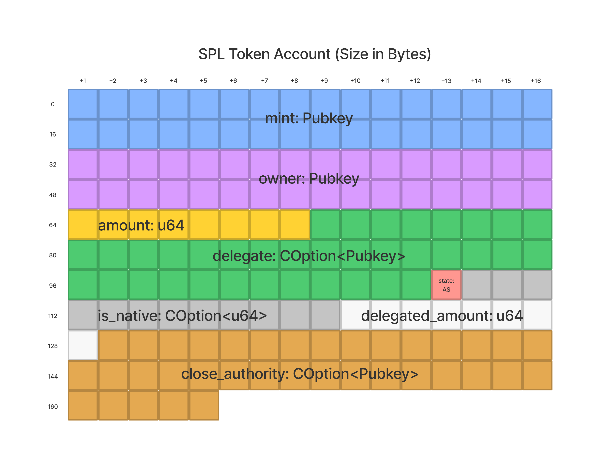

# Get Program Accounts

An RPC method that returns all accounts owned by a program. Currently pagination is not supported. Requests to `getProgramAccounts` should include the `dataSlice` and/or `filters` parameters to improve response time and return only intended results. 

## Facts

::: tip Parameters

- `programId`: `string` - Pubkey of the program to query, provided as a base58 encoded string
- (optional) `configOrCommitment`: `object` - Configuration parameters containing the following optional fields:
    - (optional) `commitment`: `string` - [State commitment](https://docs.solana.com/developing/clients/jsonrpc-api#configuring-state-commitment)
    - (optional) `encoding`: `string` - Encoding for account data, either: `base58`, `base64`, or `jsonParsed`. Note, web3js users should instead use [getParsedProgramAccounts](https://solana-labs.github.io/solana-web3.js/classes/Connection.html#getParsedProgramAccounts)
    - (optional) `dataSlice`: `object` - Limit the returned account data based on:
        - `offset`: `number` - Number of bytes into account data to begin returning
        - `length`: `number` - Number of bytes of account data to return
    - (optional) `filters`: `array` - Filter results using the following filter objects:
        - `memcmp`: `object` - Match a series of bytes to account data:
            - `offset`: `number` - Number of bytes into account data to begin comparing
            - `bytes`: `string` - Data to match, as base58 encoded string limited to 129 bytes
        - `dataSize`: `number` - Compares the account data length with the provided data size
    - (optional) `withContext`: `boolean` - Wrap the result in an [RpcResponse JSON object](https://docs.solana.com/developing/clients/jsonrpc-api#rpcresponse-structure)

##### Response

By default `getProgramAccounts` will return an array of JSON objects with the following structure:

- `pubkey`: `string` - The account pubkey as a base58 encoded string
- `account`: `object` - a JSON object, with the following sub fields:
    - `lamports`: `number`, number of lamports assigned to the account
    - `owner`: `string`, The base58 encoded pubkey of the program the account has been assigned to
    - `data`: `string` | `object` - data associated with the account, either as encoded binary data or JSON format depending on the provided encoding parameter
    - `executable`: `boolean`, Indication if the account contains a program
    - `rentEpoch`: `number`, The epoch at which this account will next owe rent
:::

## Deep Dive

`getProgramAccounts` is a versatile RPC method that returns all accounts owned by a program. We can use `getProgramAccounts` for a number of useful queries, such as finding:

- All token accounts for a particular wallet
- All token accounts for a particular mint (i.e. All [SRM](https://www.projectserum.com/) holders)
- All custom accounts for a particular program (i.e. All [Mango](https://mango.markets/) users)

Despite its usefulness, `getProgramAccounts` is often misunderstood due to its current constraints. Many of the queries supported by `getProgramAccounts` require RPC nodes to scan large sets of data. These scans are both memory and resource intensive. As a result, calls that are too frequent or too large in scope can result in connection timeouts. Furthermore, at the time of this writing, the `getProgramAccounts` endpoint does not support pagination. If the results of a query are too large, the response will be truncated.

To get around these current constraints, `getProgramAccounts` offers a number of useful parameters: namely, `dataSlice` and the `filters` options `memcmp` and `dataSize`. By providing combinations of these parameters, we can reduce the scope of our queries down to manageable and predictable sizes.

A common example of `getProgramAccounts` involves interacting with the [SPL-Token Program](https://spl.solana.com/token). Requesting all accounts owned by the Token Program with a [basic call](../references/accounts.md#get-program-accounts) would involve an enormous amount of data. By providing parameters, however, we can efficiently request just the data we intend to use.

### `filters`
The most common parameter to use with `getProgramAccounts` is the `filters` array. This array accepts two types of filters,`dataSize` and `memcmp`. Before using either of these filters, we should be familiar with how the data we are requesting is laid out and serialized.

#### `dataSize`
In the case of the Token Program, we can see that [token accounts are 165 bytes in length](https://github.com/solana-labs/solana-program-library/blob/08d9999f997a8bf38719679be9d572f119d0d960/token/program/src/state.rs#L86-L106). Specifically, a token account has eight different fields, with each field requiring a predictable number of bytes. We can visualize how this data is laid out using the below illustration.

If we wanted to find all token accounts owned by our wallet address, we could add `{ dataSize: 165 }` to our `filters` array to narrow the scope of our query to just accounts that are exactly 165 bytes in length. This alone, however, would be insufficient. We would also need to add a filter that looks for accounts owned by our address. We can achieve this with the `memcmp` filter.

#### `memcmp`
The `memcmp` filter, or "memory comparison" filter, allows us to compare data at any field stored on our account. Specifically, we can query only for accounts that match a particular set of bytes at a particular position. `memcmp` requires two arguments:

- `offset`: The position at which to begin comparing data. This position is measured in bytes and is expressed as an integer.
- `bytes`: The data that should match the account's data. This is represented as a base-58 encoded string should be limited to less than 129 bytes.

It's important to note that `memcmp` will only return results that are an exact match on `bytes`. Currently, it does not support comparisons for values that are less than or greater than the `bytes` we provide.

In keeping with our Token Program example, we can amend our query to only return token accounts that are owned by our wallet address. When looking at a token account, we can see the first two fields stored on a token account are both pubkeys, and that each pubkey is 32 bytes in length. Given that `owner` is the second field, we should begin our `memcmp` at an `offset` of 32 bytes. From here, we’ll be looking for accounts whose owner field matches our wallet address.

We can invoke this query via the following example:

<CodeGroup>
  <CodeGroupItem title="TS" active>

@[code](@/code/get-program-accounts/memcmp/memcmp.en.ts)

  </CodeGroupItem>

  <CodeGroupItem title="Rust Client" active>

@[code](@/code/get-program-accounts/memcmp/memcmp.en.rs)

  </CodeGroupItem>

  <CodeGroupItem title="cURL" active>

@[code](@/code/get-program-accounts/memcmp/memcmp.en.sh)

  </CodeGroupItem>
</CodeGroup>

### `dataSlice`

Outside of the two filter parameters, the third most common parameter for `getProgramAccounts` is `dataSlice`. Unlike the `filters` parameter, `dataSlice` will not reduce the number of accounts returned by a query. Instead, `dataSlice` will limit the amount of data for each account.

Much like `memcmp`, `dataSlice` accepts two arguments:

- `offset`: The position (in number of bytes) at which to begin returning account data
- `length`: The number of bytes which should be returned

`dataSlice` is particularly useful when we run queries on a large dataset but don’t actually care about the account data itself. An example of this would be if we wanted to find the number of token accounts (i.e. number of token holders) for a particular token mint.

<CodeGroup>
  <CodeGroupItem title="TS" active>

@[code](@/code/get-program-accounts/dataSlice/dataSlice.en.ts)

  </CodeGroupItem>

  <CodeGroupItem title="Rust Client" active>

@[code](@/code/get-program-accounts/dataSlice/dataSlice.en.rs)

  </CodeGroupItem>

  <CodeGroupItem title="cURL" active>

@[code](@/code/get-program-accounts/dataSlice/dataSlice.en.sh)

  </CodeGroupItem>
</CodeGroup>

By combining all three parameters (`dataSlice`, `dataSize`, and `memcmp`) we can limit the scope of our query and efficiently return only the data we’re interested in.

## Other Resources

- [RPC API Documentation](https://docs.solana.com/developing/clients/jsonrpc-api#getprogramaccounts)
- [Web3js Documentation](https://solana-labs.github.io/solana-web3.js/classes/Connection.html#getProgramAccounts)
- [JSON-parsed Web3js Documentation](https://solana-labs.github.io/solana-web3.js/classes/Connection.html#getParsedProgramAccounts)
