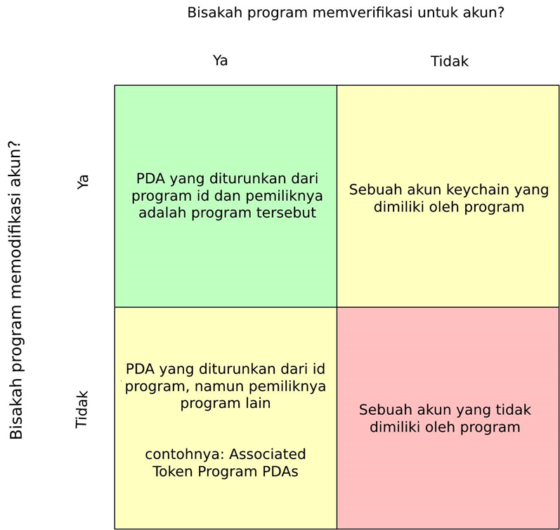

# Program Derived Addresses (PDA)

Program Derived Addresses (PDA) adalah tempat seperti rumah untuk akun-akun yang di desain untuk dikendalikan oleh suatu program tertentu. Dengan PDA, program bisa memverifikasi alamat tertentu secara terprogram tanpa membutuhkan private key. PDA berfungsi sebagai fondasi untuk [Cross-Program Invocation](https://docs.solana.com/developing/programming-model/calling-between-programs#cross-program-invocations), yang memungkinkan aplikasi Solana dapat disusun satu sama lain.

## Fakta-Fakta

::: tip Fakta
- PDA adalah string 32 byte yang mirip seperti public key, namun tidak memiliki private key
- `findProgramAddress` akan menurunkan sebuah PDA dari programld dan seeds (kumpulan byte) secara deterministik
- Satu byte (bump) digunakan untuk mendorong sebuah potential PDA dari `ed25519 elliptic curve`
- Program bisa memverifikasi PDA-nya dengan menyediakan seeds dan bump untuk [invoke_signed](https://docs.solana.com/developing/programming-model/calling-between-programs#program-signed-accounts)
- Sebuah PDA hanya bisa diverifikasi oleh program asalnya
- Selain untuk mengizinkan program diverifikasi dengan instruksi lain, PDA juga menyediakan antarmuka (_interface_) seperti hashmap untuk [Mengindeks Akun](../guides/account-maps.md)
:::

# Lebih Dalam

PDA adalah bahan penting untuk mengembangkan program di Solana. Dengan PDA, program-program dapat memverifikasi akun sambil menjamin tidak ada pengguna dari luar yang bisa memverifikasi akun yang sama. Selain memverifikasi akun, program tertentu juga dapat memodifikasi akun dalam PDA masing-masing.

<small style="text-align:center;display:block;">Image courtesy of <a href="https://twitter.com/pencilflip">Pencilflip</a></small>

### Membuat PDA

Untuk memahami konsep PDA, akan sangat membantu untuk memandang PDA sebagai sesuatu yang “ditemukan” dan bukan “diciptakan”. PDA dihasilkan dari kombinasi seeds (seperti string `“vote_account”`) dan sebuah program id. Kombinasi seeds ini kemudian dijalankan melalui sebuah fungsi  sha256 hash untuk melihat bahwa mereka menghasilkan sebuah public key yang berdasarkan pada `ed25519 elliptic curve` atau tidak.

Dalam menjalankan program id dan seeds dengan sebuah fungsi hash, ada 50% kemungkinan menghasilkan sebuah public key yang valid namun tidak tepat di kurva ekliptik. Dalam kasus ini, yang dapat dilakukan adalah menambahkan sesuatu (fudge) untuk mendorong input dan uji coba ulang. Istilah teknis dari fudge ini adalah bump. Dalam Solana, dimulai dengan bump = 255 dan secara perlahan turunkan nilainya bump = 254, bump = 253 dan seterusnya. Sampai kita mendapatkan alamat (_address_) yang tidak ada di `elliptic curve`. Cara ini memang belum sempurna, namun ketika membuahkan hasil, ini memberikan kita cara deterministik untuk menurunkan PDA yang sama berulang kali. 

### Berinteraksi dengan PDAs

Ketika sebuah PDA dihasilkan, `findProgramAddress` akan mengembalikan alamat dan juga bump yang digunakan untuk mengeluarkannya dari `elliptic curve`. Dilengkapi dengan bump ini, sebuah program dapat [memverifikasi](../references/accounts.md#sign-with-a-pda) instruksi apapun yang dibutuhkan oleh PDA tersebut. Untuk memverifikasi, program harus meloloskan instruksi, sejumlah akun, dan seeds yang digunakan untuk menurunkan PDA ke `invoke_signed`. Selain memverifikasi instruksi, PDA juga harus memverifikasi hasilnya via `invoke_signed`.

Ketika pembuatan dangan PDA, sangatlah umum untuk [menyimpan *bump seed*](https://github.com/solana-labs/solana-program-library/blob/78e29e9238e555967b9125799d7d420d7d12b959/token-swap/program/src/state.rs#L100) di data akun tersebut. Hal ini mengizinkan pada developer untuk memvalidasi sebuah PDA tanpa harus melewati bump sebagai argumen instruksi.

## Sumber lainnya
- [Official Documentation](https://docs.solana.com/developing/programming-model/calling-between-programs#program-derived-addresses)
- [Understanding Program Derived Addresses](https://www.brianfriel.xyz/understanding-program-derived-addresses/)
