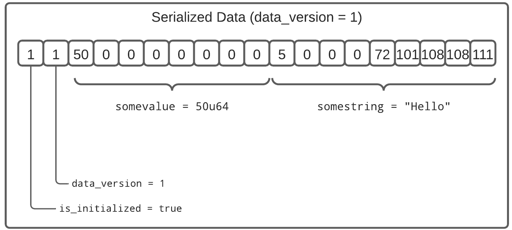

# Account Data Versioning

## What is data versioning?

Fundamentally to version data means to create a unique reference for a collection of data. This reference can take the form of a query, an **ID**, or also commonly a datetime identifier.

## Simple scenario
1. You create a program that stores a `u64` value in your program's accounts data. For example, assuming you've initialized the account with a 1024k data block and an instruction to set `somevalue` to `50u64`. You'd end up with the serialized data layout shown below (using borsh serialization)

| ID | Best Practices |
| - | - |
|1| Include a 'data version' field in your data. It can be a simple incrementing ordinal (e.g. u8) or something more sophisticated
|2| Allocate enough space for data growth

2. Now your planning a new release of your program where you want to add a **required** string property `somestring` and you're not sure how to deal with your program accounts that would be 'back level', like the one in the above diagram

| Possible Options |
| - |
| This document describes an '**upgrade in place**' strategy that detects data version changes when deserialing the account and 'uplifts' the old version layout to the new one while hiding this transition from your main program code
| Solana has a new feature, not yet released at the time of this writing, that allows you to "reallocate" the account data size. You'd still need to take care of uplifting the data layout to include your new properties(s)

The remainder of the document uses code extracted from a [Reference Implementation](#resources)

### Initial Program (Version 0)
As the above diagram shows in the source code, we've already fit our controlling 'header' `ProgramAccountState` with a data version identifier and an embedded struct that holds the operational content `AccountContentCurrent`.

<CodeGroup>
  <CodeGroupItem title="Account">

  @[code](@/code/data-versioning/rust.account_state.en.rs)

  </CodeGroupItem>
</CodeGroup>

| Line(s) | Note |
| ------- | - |
| 8 | We use Solana's `Pack` trait to generalize the serialization interface
| 52-73| We use a number of constants that may seem redundant at first, but when we 'upgrade' our program their colors start to shine
| 77 | We add an uplift strategy hook that, in our '0' version, just returns the current state. This will be a key area to modify if we add/delete our content properties

The remainder of the program logic is fairly typical

<CodeGroup>
  <CodeGroupItem title="Instruction">

  @[code](@/code/data-versioning/rust.instruction.en.rs)

  </CodeGroupItem>

  <CodeGroupItem title="Processor">

  @[code](@/code/data-versioning/rust.processor.en.rs)

  </CodeGroupItem>
</CodeGroup>

### Updated Program (Version 1)
In our new program we want to add a new property for the content state. The changes that follow are how we leveraged the initial program constructs as they come into use now.

#### Account State
Our first step is to adjust our content structures and fill codify the uplift logic in `fn conversion_logic`:

<CodeGroup>
  <CodeGroupItem title="Account">

  @[code](@/code/data-versioning/rust.account_state1.en.rs)

  </CodeGroupItem>
</CodeGroup>

| Line(s) | Note |
| ------- | - |
| 6 | We've added Solana's `solana_program::borsh::try_from_slice_unchecked` to simplify reading subsets of data from the larger data block
| 13-26| Here we've preserved the old content structure, `AccountContentOld` line 24, before extending the `AccountContentCurrent` starting in line 17.
| 60 | We bump the `DATA_VERSION` constant
| 71 | We now have a 'previous' version and we want to know it's size
| 86 | The Coup de grâce is adding the plumbing to uplift the previous content state to the new (current) content state

We then update our instructions, to add a new one for updating `somestring`, and processor for handling the new instruction. Note that the 'uplifting' the data structure is encapsulated behind `pack/unpack`

<CodeGroup>
  <CodeGroupItem title="Instruction">

  @[code](@/code/data-versioning/rust.instruction1.en.rs)

  </CodeGroupItem>

  <CodeGroupItem title="Processor">

  @[code](@/code/data-versioning/rust.processor1.en.rs)

  </CodeGroupItem>
</CodeGroup>

After building and submitting an instruction: `VersionProgramInstruction::SetString(String)` we now have the following 'uplifted' account data layout

## Resources

* [Borsh Specification](https://borsh.io/)
* [Solana `try_from_slice_unchecked`](https://github.com/solana-labs/solana/blob/master/sdk/program/src/borsh.rs#L67)
* [Reference Implementation](https://github.com/FrankC01/versioning-solana)
