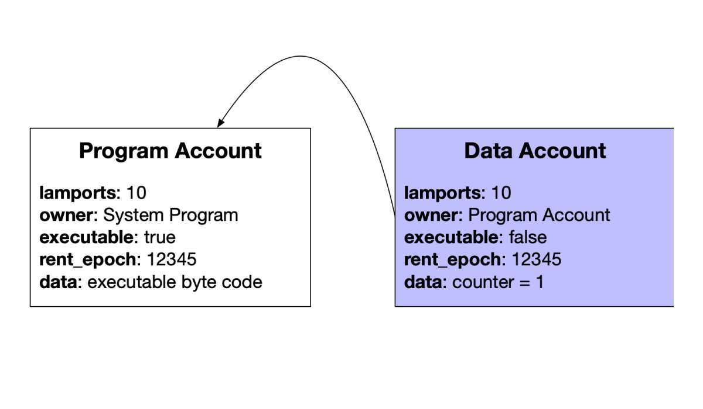

# Accounts

Solana에서 Account는 상태를 저장하기 위해 사용됩니다.  
Account는 Solana에서 개발을 위한 가장 필수적인 구성 요소입니다.

## Facts

::: tip Fact Sheet

- Account는 데이터를 저장하기 위해 사용됩니다.
- 각 Account는 유일한 address를 갖고 있습니다.
- Account는 10MB의 최대 크기를 가집니다.
- PDA Account는 10KB의 최대 크기를 가집니다.
- PDA Account는 Program을 대신해 서명하기 위해 사용될 수 있습니다.
- Account 크기는 생성 시점에 고정됩니다. 하지만 [realloc](https://solanacookbook.com/references/programs.html#how-to-change-account-size)을 사용해서 조정될 수 있습니다.
- Account 데이터 저장은 rent라는 비용이 발생합니다.
- 기본적으로 Account의 소유자는 System Program입니다.
  :::

## Deep Dive

### Account Model

솔라나에는 3가지 종류의 Accounts가 있습니다:

- Data Account는 데이터를 저장합니다.
- Program Account는 실행 가능한 프로그램들을 저장합니다.
- Native Account는 솔라나에 있는 System, Stake, Vote 같은 Native 프로그램입니다.

Data Account에는 2가지 타입이 있습니다:

- System이 소유한 Account
- PDA (Program Derived Address) Account

각 Account는 주소(보통 public key)와 소유자(프로그램 Account의 주소)를 갖고 있습니다.  
한 Account가 저장하는 전체 필드 리스트는 아래와 같습니다.

| Field      | Description                               |
| ---------- | ----------------------------------------- |
| lamports   | Account가 소유하고 있는 lamport의 개수          |
| owner      | Account를 소유하고 있는 Program               |
| executable | Account가 Instruction들을 처리할 수 있는지 여부  |
| data       | Account가 저장한 byte array 원본 데이터        |
| rent_epoch | Account가 rent를 할 다음 epoch               |

ownership에 대한 중요한 몇 가지 규칙이 있습니다.:

- Data Account의 소유자만 오직 이 Account의 데이터를 수정할 수 있고, lamports를 인출할 수 있습니다.
- 누구나 Data Account에 lamports들을 입금할 수 있습니다.
- Account의 소유자는 이 Account의 데이터가 비어있다면 새로운 소유자에게 이 Account를 할당할 수 있습니다.

Program Account는 상태를 저장하지 않습니다.

예를 들어, 만약 counter를 증가시킬 수 있는 counter program을 가지고 있다면, 두 개의 Account를 생성해야 합니다.  
하나는 Program의 Code를 저장하는 Account이고, 다른 하나는 counter 데이터를 저장하는 Account입니다.

Account가 삭제되는 것을 막기 위해서는 rent를 지불해야 합니다.

### Rent

Account에 데이터를 저장하는 것은 메인넷에 SOL 비용을 발생시키고, rent라고 불리는 것에 의해 걷어집니다.  
만약 한 Account에 2년 치의 rent 지불과 동등한 balance를 유지한다면, Account는 rent를 지불하는 것이 면제됩니다.  
Account 사용을 마치면 rent를 되찾을 수 있고 lamports를 지갑에 보낼 수 있습니다.

Rent는 두 가지 타이밍에 지불됩니다:

1. Transaction에 의해 참조될 때
2. 매 epoch 마다

A percentage of rent collected by accounts is destroyed, while the rest is distributed
to vote accounts at the end of every slot.

만약 Account가 rent를 지불하기 위한 충분한 lamports를 갖고 있지 않다면, Account는 할당 해제되며 데이터는 지워집니다.

새로운 Account들은 rent 면제되도록 하는 것이 중요합니다.

## Other Resources

- [Solana Account Model](https://solana.wiki/zh-cn/docs/account-model/#account-storage)
- [Official Documentation](https://docs.solana.com/developing/programming-model/accounts)
- [pencilflip account thread](https://twitter.com/pencilflip/status/1452402100470644739)

### Credit

This core concept is credited to Pencilflip. [Follow him on Twitter](https://twitter.com/intent/user?screen_name=pencilflip).
