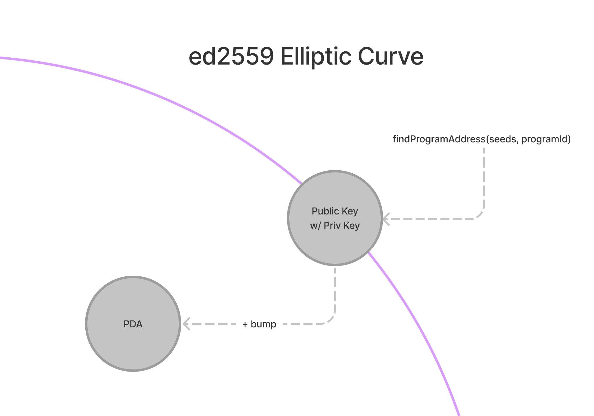

# Program Derived Addresses (PDAs)

Program Derived Addresses (PDAs)는 특정 Program에 의해 작동되도록 설계된 Account들입니다.
Program들은 PDA들을 통해 Private Key 없이 특정 Addresse에 대해 서명할 수 있습니다.
PDA는 Solana App이 다른 App들과 함께 구성될 수 있도록 하는 [Cross-Program Invocation](https://docs.solana.com/developing/programming-model/calling-between-programs#cross-program-invocations)를 위한 기반으로써의 기능을 합니다.

## Facts

::: tip Fact Sheet
- PDAs are 32 byte strings that look like public keys, but don’t have corresponding private keys
- PDA는 Public Key 처럼 보이는 32 byte의 String 이지만, 대응되는 Private Key는 없습니다.
- `findProgramAddress`는 programId와 seeds(collection of bytes) 값으로부터 정확한 PDA를 조회할 것입니다.
- bump (one byte) 는 ed25519 타원 곡선에서 잠재적인 PDA를 밀어내는 데 사용됩니다.
- Program은 seeds와 bump 값을 [invoke_signed](https://docs.solana.com/developing/programming-model/calling-between-programs#program-signed-accounts)에 제공해서 PDA들에 서명할 수 있습니다.
- PDA는 자신을 만든 Program에 의해서만 서명될 수 있습니다.
- PDA는 Program이 다른 Instruction들에 서명하도록 하는 것 뿐만 아니라, [indexing accounts](../guides/account-maps.md)를 위한 hashmap과 같은 interface 또한 제공합니다.
:::

## Deep Dive

PDA는 Solana에서 Program들을 개발하기 위한 필수적인 구성 요소입니다.
Program들은 PDA들을 가지고 Account들에 서명할 수 있고, 다른 사용자들이 같은 Account에 유효한 서명을 만들 수 없다는 것을 보장합니다.
어떤 Program들은 Account들에 서명하는 것과 더불어 그들의 PDA들에 의해 만들어진 Account들을 수정할 수도 있습니다.

<small style="text-align:center;display:block;">Image courtesy of <a href="https://twitter.com/pencilflip">Pencilflip</a></small>

### Generating PDAs

PDA에 대한 개념을 이해하기 위해서, PDA는 기술적으로 창조된 것이 아니라 발견된 것이라고 생각하는 것이 좀 더 도움이 될 수 있습니다. 
PDA들은 seed (문자열 `“vote_account”`와 같은)들과 Program ID의 조합으로 만들어집니다.
그러고 나서, 이 seed들과 Program ID의 조합은 ed25519 타원 곡선 상에서 Public Key를 만들어내는지 여부를 확인하기 위해 sha256 해시 함수로 보내집니다.

Program ID와 seeds를 해시 함수로 돌리는 동안, 타원 곡선상에 있는 유효한 Public Key를 50% 확률로 발견합니다.
이런 경우, 우리는 input 값들을 조금 다르게 하기 위해 단순히 어떤 값을 추가합니다.
이 작업을 위해 추가하는 것의 기술적인 용어는 bump입니다.
솔라나에서 bump 값은 255로 시작해서 bum=254, bump=253, etc... 와 같이 타원 곡선 상에 존재하지 않는 Address를 얻을 때까지 단순하게 값을 하나씩 내리며 반복합니다.
이것은 초보적으로 보일지 모르지만, 일단 한번 발견되면 확실히 우리는 같은 PDA를 계속해서 얻을 수 있습니다.

### Interacting with PDAs

PDA가 생성됐을 때, `findProgramAddress`는 Address를 타원 곡선 밖으로 보내기 위해 사용되도록 Address와 bump 값을 반환할 것입니다.
이 bump 값으로 무장한 Program은 PDA를 요구하는 어떤 Instruction에도 [sign](../references/accounts.md#sign-with-a-pda)할 수 있습니다.
서명을 위해 Program들은 Instruction들과 Account들의 목록 그리고 `invoked_signed`하기 위해 PDA를 얻기 위한 seeds와 bump값들을 보내야 합니다.
PDA들은 Instuction에 서명하는 것과 더불어 `invoke_signed`를 통해 자신의 생성을 위한 서명도 해야 합니다.

PDA들을 만들 때, Account Data 자체적으로 [store the bump seed](https://github.com/solana-labs/solana-program-library/blob/78e29e9238e555967b9125799d7d420d7d12b959/token-swap/program/src/state.rs#L100) 하는 것은 흔한 방법입니다. 
이것은 개발자들이 bump를 Instruction 인자로써 전송하지 않고 쉽게 PDA를 검증하도록 해줍니다.

## Other Resources
- [Official Documentation](https://docs.solana.com/developing/programming-model/calling-between-programs#program-derived-addresses)
- [Understanding Program Derived Addresses](https://www.brianfriel.xyz/understanding-program-derived-addresses/)
