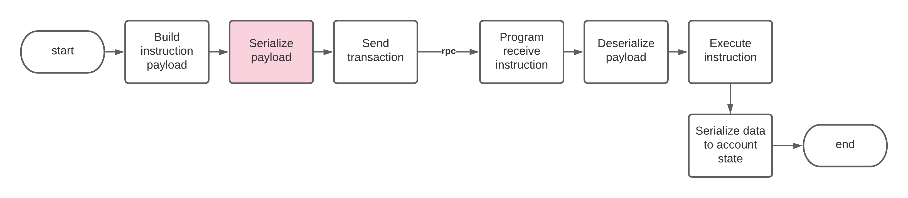

# Serializando Dados

Quando falamos sobre serialização, estamos nos referindo tanto à serialização quanto à desserialização de dados.

A serialização entra em jogo em alguns pontos ao longo do ciclo de vida dos programas e das contas de programas da Solana:

1. Serializando dados de instruções no cliente
2. Desserializando dados de instruções no programa
3. Serializando dados de contas no programa
4. Desserializando dados de contas no cliente

É importante que as ações acima sejam suportadas pela mesma abordagem de serialização. Os trechos incluídos demonstram a serialização usando o [Borsh](#resources).

Os exemplos apresentados neste documento são trechos extraídos do [Modelo de Programa da CLI da Solana](#resources)

## Configurando a Serialização com o Borsh

As bibliotecas para o Borsh devem ser configuradas para o programa Rust, cliente Rust, cliente Node e/ou Python.

<CodeGroup>
  <CodeGroupItem title="Program">

@[code](@/code/serialization/setup/Cargo.program.en.toml)

  </CodeGroupItem>

  <CodeGroupItem title="Rust Client" active>

@[code](@/code/serialization/setup/Cargo.cli.en.toml)

  </CodeGroupItem>

  <CodeGroupItem title="Node Client" active>

@[code](@/code/serialization/setup/Node.package.en.json)

  </CodeGroupItem>

  <CodeGroupItem title="Python Client" active>

@[code](@/code/serialization/setup/requirements.txt)

  </CodeGroupItem>

</CodeGroup>

## Como serializar dados de instrução no cliente

Se você estiver serializando dados de instrução de saída para enviar a um programa, ele deve espelhar como o programa desserializa os dados de instrução de entrada.

Neste modelo, um bloco de dados de instrução é um array serializado contendo, com exemplos:

| Instrução (Índice Variante) | Chave Serializada                 | Valor Serializado               |
| --------------------------- | ------------------------------ | ------------------------------ |
| Initialize (0)              | não aplicável para instrução | não aplicável para instrução |
| Mint (1)                    | "foo"                          | "bar"                          |
| Transfer (2)                | "foo"                          | não aplicável para instrução |
| Burn (2)                    | "foo"                          | não aplicável para instrução |

No exemplo a seguir, assumimos que a conta de propriedade do programa foi inicializada

<CodeGroup>
  <CodeGroupItem title="TS Client" active>

@[code](@/code/serialization/instruction/ts.client.mint.en.ts)

  </CodeGroupItem>

  <CodeGroupItem title="Python Client" active>

@[code](@/code/serialization/instruction/python.client.py)

  </CodeGroupItem>

  <CodeGroupItem title="Rust Client">

@[code](@/code/serialization/instruction/rust.client.mint.en.rs)

  </CodeGroupItem>
</CodeGroup>

## Como desserializar dados de instrução no programa

<CodeGroup>
  <CodeGroupItem title="Rust Program">

@[code](@/code/serialization/instruction/rust.program.instruction.en.rs)

  </CodeGroupItem>
</CodeGroup>

## Como serializar os dados da conta no programa

O bloco de dados da conta do programa (do repositório de amostra) é apresentado como

| Byte 0           | Bytes 1-4                     | Bytes restantes até 1019                  |
| ---------------- | ----------------------------- | ------------------------------------------- |
| Flag de inicialização | comprimento do BTreeMap serializado | BTreeMap (onde os pares chave-valor são armazenados) |

### Pack

Uma palavra sobre o trait [Pack][1]

O trait Pack facilita a ocultação dos detalhes de serialização/desserialização de dados de conta do processamento principal de instruções do seu programa. Assim, em vez de colocar todos os registros de serialização/desserialização no código de processamento do programa, ele encapsula os detalhes por trás de (3) funções:

1. `unpack_unchecked` - Permite que você desserialize uma conta sem verificar se ela foi inicializada. Isso é útil quando você está realmente processando a função de inicialização (índice de variante 0)
2. `unpack` - Chama a sua implementação Pack de `unpack_from_slice` e verifica se a conta foi inicializada
3. `pack` - Chama a sua implementação Pack de `pack_into_slice`

Aqui está a implementação do trait Pack para o nosso programa de exemplo. Isso é seguido com o processamento real dos dados da conta usando o Borsh.

<CodeGroup>
  <CodeGroupItem title="Rust Program">

@[code](@/code/serialization/program/rust.program.packimpl.en.rs)

  </CodeGroupItem>
</CodeGroup>

### Serialização/Desserialização

Para completar a serialização e desserialização subjacente:

1. `sol_template_shared::pack_into_slice` - Onde ocorre a serialização real
2. `sol_template_shared::unpack_from_slice` - Onde ocorre a desserialização real

**Observação:** no código a seguir temos uma partição `u32` (4 bytes) no layout de dados para
`BTREE_LENGTH` que precede o `BTREE_STORAGE`. Isso ocorre porque, durante a desserialização, o Borsh verifica se o comprimento da fatia que está sendo desserializada corresponde à quantidade de dados lidos antes de realmente recompor o objeto de destino. A abordagem demonstrada abaixo primeiro lê o `BTREE_LENGTH` para obter o tamanho da fatia (`slice`) a ser retirada do ponteiro `BTREE_STORAGE`.

<CodeGroup>
  <CodeGroupItem title="Rust Program">

@[code](@/code/serialization/program/rust.program.serdeser.en.rs)

  </CodeGroupItem>
</CodeGroup>

### Utilização

A seguir, tudo se junta e demonstra como o programa interage com o `ProgramAccountState`, que encapsula a flag de inicialização, bem como o `BTreeMap` subjacente para nossos pares de chave/valor.

Primeiro, quando queremos inicializar uma nova conta:

<CodeGroup>
  <CodeGroupItem title="Rust">

@[code](@/code/serialization/program/rust.program.initialize.en.rs)

  </CodeGroupItem>
</CodeGroup>

Agora podemos operar em nossas outras instruções como a seguinte demonstra a criação de um novo par chave-valor que demonstramos acima ao enviar instruções de um cliente:

<CodeGroup>
  <CodeGroupItem title="Rust">

@[code](@/code/serialization/program/rust.program.mint.en.rs)

  </CodeGroupItem>
</CodeGroup>

[1]: https://github.com/solana-labs/solana/blob/22a18a68e3ee68ae013d647e62e12128433d7230/sdk/program/src/program_pack.rs

## Como desserializar dados da conta no cliente

Os clientes podem chamar a Solana para buscar contas de propriedade do programa, em que o bloco de dados serializados é parte do retorno. A desserialização requer conhecer o layout do bloco de dados.

O layout dos dados da conta foi descrito [Aqui](#account-data-serialization)

<CodeGroup>
  <CodeGroupItem title="TS" active>

@[code](@/code/serialization/clientdata/ts.client.data.en.ts)

  </CodeGroupItem>

  <CodeGroupItem title="Python" active>

@[code](@/code/serialization/clientdata/python.client.data.py)

  </CodeGroupItem>

  <CodeGroupItem title="Rust">

@[code](@/code/serialization/clientdata/rust.client.data.en.rs)

  </CodeGroupItem>
</CodeGroup>

## Mapeamentos comuns da Solana em TypeScript/JavaScript

A [Especificação do Borsh](#resources) contêm a maioria dos mapeamentos para tipos de dados primitivos e compostos.

A chave para TS/JS e Python é criar um esquema Borsh com uma definição adequada para que a serialização e desserialização possam gerar ou percorrer as respectivas entradas.

Aqui demonstramos a serialização de tipos primitivos (números, strings) e tipos compostos (array de tamanho fixo, mapeamento) primeiro em Typescript, depois em Python e, em seguida, a desserialização equivalente no lado do Rust:

<CodeGroup>
  <CodeGroupItem title="TS" active>

@[code](@/code/serialization/primitives/demo_primitives.en.ts)

  </CodeGroupItem>

  <CodeGroupItem title="Python" active>

@[code](@/code/serialization/primitives/python.demo_primitives.py)

  </CodeGroupItem>

  <CodeGroupItem title="Rust">

@[code](@/code/serialization/primitives/src/main.rs)

  </CodeGroupItem>
</CodeGroup>

## Construções avançadas

Mostramos como criar cargas úteis (payloads) simples em exemplos anteriores. Às vezes, a Solana apresenta alguns tipos mais complexos. Esta seção demonstrará a correspondência adequada entre TS/JS e Rust para lidar com esses tipos.

### COption

<CodeGroup>
  <CodeGroupItem title="TS" active>

@[code](@/code/serialization/coption/demo_coption.en.ts)

  </CodeGroupItem>

  <CodeGroupItem title="Rust">

@[code](@/code/serialization/coption/src/main.rs)

  </CodeGroupItem>
</CodeGroup>

## Resources

- [Especificação do Borsh](https://borsh.io/)
- [Rust - Borsh](https://github.com/near/borsh-rs)
- [TS/JS - Borsh](https://github.com/near/borsh-js)
- [Python - Borsh](https://github.com/near/borsh-construct-py)
- [Documentação Python - Borsh](https://near.github.io/borsh-construct-py/)
- [Modelo de Programa da CLI da Solana](https://github.com/hashblock/solana-cli-program-template)
