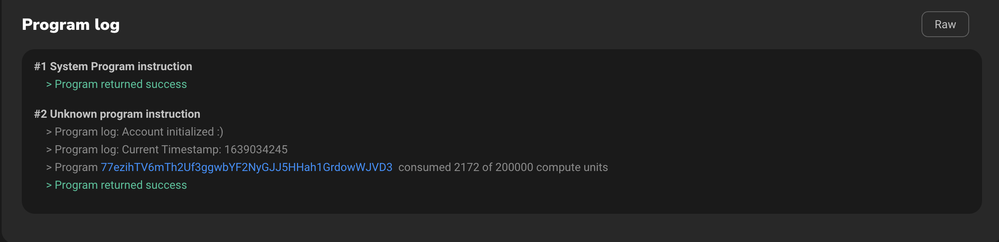
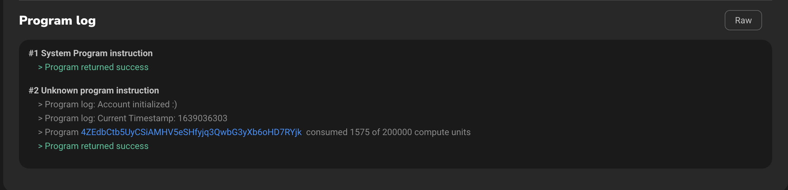

# Programs

## How to get clock in a program

Getting a clock can be done in two ways

1. Passing `SYSVAR_CLOCK_PUBKEY` into an instruction
2. Accessing Clock directly inside an instruction.

It is nice to know both the methods, because some legacy programs still expect the `SYSVAR_CLOCK_PUBKEY` as an account.

### Passing Clock as an account inside an instruction

Let's create an instruction which receives an account for initializing and the sysvar pubkey

<SolanaCodeGroup>
  <SolanaCodeGroupItem title="Rust" active>

  <template v-slot:default>

@[code](@/code/programs/get-clock/method-one/program/src/lib.rs)

  </template>

  <template v-slot:preview>

@[code](@/code/programs/get-clock/method-one/program/src/lib.preview.rs)

  </template>

  </SolanaCodeGroupItem>
</SolanaCodeGroup>

Now we pass the clock's sysvar public address via the client

<SolanaCodeGroup>
  <SolanaCodeGroupItem title="TS" active>

  <template v-slot:default>

@[code](@/code/programs/get-clock/method-one/client/main.en.ts)

  </template>

  <template v-slot:preview>

@[code](@/code/programs/get-clock/method-one/client/main.preview.en.ts)

  </template>

  </SolanaCodeGroupItem>
</SolanaCodeGroup>

Running the above client side instruction, will lead to the following program log

### Accessing Clock directly inside an instruction

Let's create the same instruction, but without expecting the `SYSVAR_CLOCK_PUBKEY` from the client side.

<SolanaCodeGroup>
  <SolanaCodeGroupItem title="Rust" active>

  <template v-slot:default>

@[code](@/code/programs/get-clock/method-two/program/src/lib.rs)

  </template>

  <template v-slot:preview>

@[code](@/code/programs/get-clock/method-two/program/src/lib.preview.rs)

  </template>

  </SolanaCodeGroupItem>
</SolanaCodeGroup>

The client side instruction, now only needs to pass the state and payer accounts.

<SolanaCodeGroup>
  <SolanaCodeGroupItem title="TS" active>

  <template v-slot:default>

@[code](@/code/programs/get-clock/method-two/client/main.en.ts)

  </template>

  <template v-slot:preview>

@[code](@/code/programs/get-clock/method-two/client/main.preview.en.ts)

  </template>

  </SolanaCodeGroupItem>
</SolanaCodeGroup>

Running the above client side instruction, will lead to the following program log

