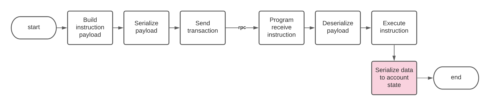

# Tuần tự hoá dữ liệu

Khi nói đến tuần tự hoá nghĩa là tác giả đang muốn đề cập đến cả tuần tự và phi tuần tự hoá dữ liệu.

Tuần tự hoá tham gia vào một vài điểm trong vòng đời của Solana Program và Program Account:

1. Tuần tự hoá dữ liệu câu chỉ thị được gửi từ người dùng
2. Phi tuần tự hoá dữ liệu chỉ thị trong Program
3. Tuần tự hoá dữ liệu Account trong Program
4. Phi tuần tự hoá dữ liệu Account ở phía người dùng

Một điều quan trọng là tất cả các quá trình bên trên đều được hỗ trợ bởi duy nhất một phương pháp tuần tự hoá. Một vài đoạn code mẫu trong bài sẽ sử dụng [Borsh](#resources) để làm ví dụ.

Phần còn lại sẽ được trích dẫn hầu hết từ [Solana CLI Program Template](#resources).

## Cài đặt Tuần tự hoá Borsh

Những thư viện lập trình cho Borsh phải được cài đặt tương thích với chương trình Rust, Node, và/hoặc Python.

<CodeGroup>
  <CodeGroupItem title="Program">

@[code](@/code/serialization/setup/Cargo.program.en.toml)

  </CodeGroupItem>

  <CodeGroupItem title="Rust Client" active>

@[code](@/code/serialization/setup/Cargo.cli.en.toml)

  </CodeGroupItem>

  <CodeGroupItem title="Node Client" active>

@[code](@/code/serialization/setup/Node.package.en.json)

  </CodeGroupItem>

  <CodeGroupItem title="Python Client" active>

@[code](@/code/serialization/setup/requirements.txt)

  </CodeGroupItem>

</CodeGroup>

## Làm thế nào để tuần tự hoá dữ liệu của các chỉ thị từ phía người dùng

Nếu bạn đang tuần tự hoá dữ liệu của một chỉ thị ở phía người dùng để gửi lên Program, bạn cần chắc chắn rằng Program sẽ phi tuần tự hoá chỉ thị đó và đúng nguyên bản ban đầu.

Trong mẫu sau, một khối dữ liệu chỉ thị được chứa trong một mảng tuần tự như sau:

| Chỉ thị (Chỉ mục)           | Khoá tuần tự                   | Giá trị tuần tự                |
| --------------------------- | ------------------------------ | ------------------------------ |
| Initialize (0)              | Bất khả thi cho chỉ thị        | Bất khả thi cho chỉ thị        |
| Mint (1)                    | "foo"                          | "bar"                          |
| Transfer (2)                | "foo"                          | Bất khả thi cho chỉ thị        |
| Burn (3)                    | "foo"                          | Bất khả thi cho chỉ thị        |

Trong ví dụ sau đây, giả sử Program sở hữu Account đã được khởi tạo từ trước.

<CodeGroup>
  <CodeGroupItem title="TS Client" active>

@[code](@/code/serialization/instruction/ts.client.mint.en.ts)

  </CodeGroupItem>

  <CodeGroupItem title="Python Client" active>

@[code](@/code/serialization/instruction/python.client.py)

  </CodeGroupItem>

  <CodeGroupItem title="Rust Client">

@[code](@/code/serialization/instruction/rust.client.mint.en.rs)

  </CodeGroupItem>
</CodeGroup>

## Làm thế nào để phi tuần tự hoá dữ liệu của các chỉ thị trên Program

<CodeGroup>
  <CodeGroupItem title="Rust Program">

@[code](@/code/serialization/instruction/rust.program.instruction.en.rs)

  </CodeGroupItem>
</CodeGroup>

##  Làm thế nào để tuần tự hoá dữ liệu Account trên Program

Một khối dữ liệu Account của Program (từ repo mẫu) được sắp xếp như sau:

| Byte 0           | Bytes 1-4                               | Bytes còn lại (lên đến 1019)                |
| ---------------- | --------------------------------------- | ------------------------------------------- |
| Cờ khởi tạo      | Độ dài của BTreeMap đã được tuần tự hoá | BTreeMap (nơi lưu trữ các cặp key-value)    |

### Pack (Đóng gói)

Từ [Pack][1] ở đây có nghĩa là một Trait (Đặc điểm) trong Rust.

Pack giúp quá trình tuần tự và phi tuần hoá ẩn đi những chi tiết phức tạp bên dưới, đồng thời cung cấp tính dễ đọc cho quá trình xử lý các chỉ thị trong Program. Thay vì đặt tất cả các đoạn mã tuần tự và phi tuần tự hoá trực tiếp trong quá trình xử lý của Program, chúng nên được trừu tượng hoá và đóng gói lại thành những hàm chức năng (3):

1. `unpack_unchecked` - Cho phép bạn phi tuần tự hoá dữ liệu Account mà không quan tấm Account đã khởi tạo hay chứa. Nó khá hữu ích khi bạn cần xử lý hàm Initialization (chỉ mục 0).
2. `unpack` - Gọi `unpack_from_slice` trong hiện thực Pack của bạn và kiểm tra xem Account đã được khởi tạo hay chưa.
3. `pack` - Gọi `pack_into_slice` trong hiện thực Pack của bạn.

Dưới đây là một hiện thực Pack cho chương tình mẫu của chúng ta. Theo sau đó là đoạn code mẫu xử lý dữ liệu Account thực bằng Borsh.

<CodeGroup>
  <CodeGroupItem title="Rust Program">

@[code](@/code/serialization/program/rust.program.packimpl.en.rs)

  </CodeGroupItem>
</CodeGroup>

### Tuần tự hoá và Phi tuần tự hoá

Để hoàn thành các hàm tuần tự và phi tuần tự hoá cơ sở:

1. `sol_template_shared::pack_into_slice` - Điểm thực sự diễn ra quá trình tuần tự hoá
2. `sol_template_shared::unpack_from_slice` - Điểm thực sự diễn ra quá trình phi tuần tự hoá

**Lưu ý** rằng trong code mẫu bên dưới, chúng ta có một vùng nhớ 4 bytes cho `u32` dành cho `BTREE_LENGTH` ngay trước `BTREE_STORAGE`. Việc này giúp Borsh, trong quá trình phi tuần tự hoá, có thể kiểm tra độ lớn của vùng nhớ mà nó cần phải trích xuất để xử lý, cũng như tái tạo lại đối tượng đã được tuần tự hoá trước đây. Phương pháp này được minh hoạ bên dưới khi mà `BTREE_LENGTH` được đọc trước tiên nhằm lấy được kích thước của `slice` ra khỏi con trỏ `BTREE_STROAGE`.

<CodeGroup>
  <CodeGroupItem title="Rust Program">

@[code](@/code/serialization/program/rust.program.serdeser.en.rs)

  </CodeGroupItem>
</CodeGroup>

### Cách dùng

Sau đây, chúng ta sẽ tổng hợp lại tất cả các đoạn code mẫu bên trên và giải thích cách mà Program tương tác với `ProgramAccountState`. Trong đó, `ProgramAccountState` là đóng gói của trạng thái khởi tạo của Account cũng như `BTreeMap` cho các cặp key-value.

Đầu tiên, để khởi tạo một Account mới hoàn toàn:

<CodeGroup>
  <CodeGroupItem title="Rust">

@[code](@/code/serialization/program/rust.program.initialize.en.rs)

  </CodeGroupItem>
</CodeGroup>

Sau đó, chúng ta có thể dùng chúng trong quá trình xử lý của các chỉ thị. Ví như minh hoạ bên dưới có thể tiếp nhận chỉ thị từ phía người dùng và gán một cặp key-value vào trong `ProgramAccountState` đã khởi tạo bên trên.

<CodeGroup>
  <CodeGroupItem title="Rust">

@[code](@/code/serialization/program/rust.program.mint.en.rs)

  </CodeGroupItem>
</CodeGroup>

[1]: https://github.com/solana-labs/solana/blob/22a18a68e3ee68ae013d647e62e12128433d7230/sdk/program/src/program_pack.rs

## Làm thế nào để tuần hoá dữ liệu Account ở phía người dùng

Người dùng có thể gọi Solana để lấy dữ liệu dưới dạng các khối dữ liệu đã được tuần tự hoá. Quá trình phi tuần tự hoá dữ liệu này cần người dùng phải hiểu được cấu trúc của dữ liệu gốc.

Cấu trúc của dữ liệu Account được định nghĩa [ở đây](#account-data-serialization)

<CodeGroup>
  <CodeGroupItem title="TS" active>

@[code](@/code/serialization/clientdata/ts.client.data.en.ts)

  </CodeGroupItem>

  <CodeGroupItem title="Python" active>

@[code](@/code/serialization/clientdata/python.client.data.py)

  </CodeGroupItem>

  <CodeGroupItem title="Rust">

@[code](@/code/serialization/clientdata/rust.client.data.en.rs)

  </CodeGroupItem>
</CodeGroup>

## Mapping cơ bản bằng TS/JS cho Solana

[Mô tả của Borsh](#resources) chứa hầu hết các mapping cho các dữ liệu nguyên thuỷ và các dữ liệu phức.

Mấu chốt trong TS/JS, và kể cả Python, là tạo ra một Borsh Schema với các định nghĩa chính xác sao cho việc tuần tự và phi tuần tuận hoá có thể vận hành được trên dữ liệu đầu vào.

Sau đây là một minh hoạ về tuần tự hoá dữ liệu nguyên thuỷ (`numbers`, `strings`) và dữ liệu phức (`array` với kích thức cố định, `Map`) trong Typescript hoặc Python. Tiếp đến là phi tuần tự hoá dữ liệu đó bằng Rust.

<CodeGroup>
  <CodeGroupItem title="TS" active>

@[code](@/code/serialization/primitives/demo_primitives.en.ts)

  </CodeGroupItem>

  <CodeGroupItem title="Python" active>

@[code](@/code/serialization/primitives/python.demo_primitives.py)

  </CodeGroupItem>

  <CodeGroupItem title="Rust">

@[code](@/code/serialization/primitives/src/main.rs)

  </CodeGroupItem>
</CodeGroup>

## Kiểu dữ liệu nâng cao

Chúng ta đã đi qua nội dung cơ bản ở các ví dụ trước. Nhưng ngoài ra, Solana còn có một vài kiểu dữ liệu tự định nghĩa khác. Trong phần này, chúng ta tìm hiểu qua các xử lý chúng bằng TS/JS và Rust.
### COption

<CodeGroup>
  <CodeGroupItem title="TS" active>

@[code](@/code/serialization/coption/demo_coption.en.ts)

  </CodeGroupItem>

  <CodeGroupItem title="Rust">

@[code](@/code/serialization/coption/src/main.rs)

  </CodeGroupItem>
</CodeGroup>

##  Các nguồn tài liệu khác

- [Borsh Specification](https://borsh.io/)
- [Rust Borsh](https://github.com/near/borsh-rs)
- [TS/JS Borsh](https://github.com/near/borsh-js)
- [Python Borsh](https://github.com/near/borsh-construct-py)
- [Python Borsh Documentation](https://near.github.io/borsh-construct-py/)
- [Solana CLI Program Template2](https://github.com/hashblock/solana-cli-program-template)
