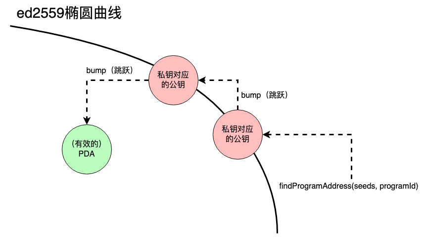

# 程序派生賬戶（PDA）

程序派生賬戶（PDA）是爲了讓特定程序可以控制一些賬戶而設計出來的。使用PDA，程序可以通過編程方法爲一些地址進行簽名，而不一定用到私鑰。
PDA是[Cross-Program Invocation（跨程序調用）](https://docs.solana.com/developing/programming-model/calling-between-programs#cross-program-invocations)的基礎，
這個功能讓Solana的app可以跟其他app進行組合。

## 綜述

::: tip 要點
- PDA是長度爲32的字節串，看起來和公鑰很像，但是並沒有與之對應的私鑰
- `findProgramAddress`可以針對一個programId（程序id）和seeds（種子）唯一確定的生成一個PDA。這裏的seeds（種子）是一組指定的字節串
- 一個跳躍（一個字節）用於將候選PDA推離ed25519橢圓曲線
- 程序通過傳入種子和跳躍參數，調用[invoke_signed](https://docs.solana.com/developing/programming-model/calling-between-programs#program-signed-accounts)爲PDA進行簽名
- PDA只能被用來派生出這個地址的程序所簽名
- 除了允許程序爲不同的instruction簽名之外，PDA還提供了一個像哈希表一樣的接口，用於[建立賬戶索引](../guides/account-maps.md)
:::

# 深入

PDA是Solana程序開發的重要構成要素。有了PDA，程序可以爲賬戶簽名，同時保證沒有外部用戶能夠產生針對同一個賬戶的有效簽名。
除了爲賬戶簽名外，一些程序還可以修改自己派生出來的PDA裏的數據。

<small style="text-align:center;display:block;">图片来源：<a href="https://twitter.com/pencilflip">Pencilflip</a></small>

### 生成PDA

爲了更好的理解PDA的概念，可以認爲PDA從技術角度講並不是創建出來的，而是找到的。PDA由一組種子（例如字符串`"vote_account"`）以及程序id生成。
這組種子和程序id接下來會放到sha256哈希函數中執行一遍，檢查他們產生的公鑰是否落在ed25519橢圓曲線上。
 
在程序id和種子上運行哈希函數時，有大約50%的概率會得到在一個落在橢圓曲線上有效的公鑰。這種情況下，我們需要向輸入當中加點擾動，略微改變輸入，再進行重試。
這個擾動的技術名稱叫bump（跳躍）。在Solana中，我們一開始指定`bump = 255`，然後向下迭代bump，到254，253等等。知道我們能夠找到一個不在橢圓曲線上的地址爲止。
這個看起來簡陋的辦法可以讓我們每次生成PDA的時候都能夠得到唯一確定的結果。

### 與PDA交互

生成PDA的時候，`findProgramAddress`會把得到的地址和用來將PDA碰撞出橢圓曲線所用的bump都返回出來。
有了這個bump，程序就可以對任何需要這個PDA地址的指令進行簽名。簽名時，程序調用`invoke_signed`函數，傳入指令，賬戶列表，以及用於生成PDA的種子和bump。
除了爲指令簽名之外，PDA在他自己通過`invoke_signed`函數被創建時，也需要簽名。

在使用PDA編寫程序時，經常會將這個bump[存儲在這個賬戶本身的數據當中](https://github.com/solana-labs/solana-program-library/blob/78e29e9238e555967b9125799d7d420d7d12b959/token-swap/program/src/state.rs#L100)。
這種機制可以讓開發者輕易的對PDA進行驗證，而不用重新在指令參數當中傳入這個值。

## 其他資料
- [官方文檔](https://docs.solana.com/developing/programming-model/calling-between-programs#program-derived-addresses)
- [Understanding Program Derived Addresses](https://www.brianfriel.xyz/understanding-program-derived-addresses/)
